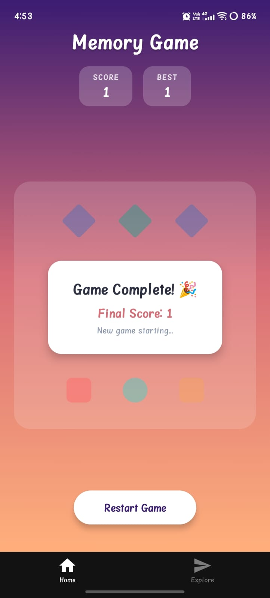
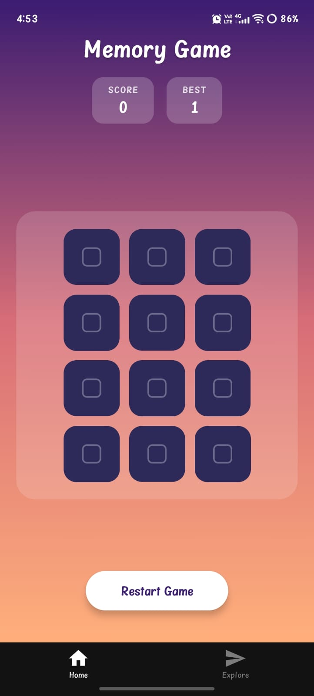

<div align="center">

# 🧠 Memory Game

### 🎮 A Beautiful Modern Memory Card Matching Game built with React Native + Expo

<p align="center">


</p>

### 🏆 Flip • Match • Win • Beat Your High Score

<br>

<a href="https://expo.dev/artifacts/eas/UZvCFoqZhtEpYvUtpDKONYoYA_27Yi0SDlB0-1ga4l8.apk">

</a>

⭐ **If you like this project, don't forget to Star the repository!**

</div>

---

# 📱 Screenshots

<div align="center">




</div>

---

# ✨ Features

 Beautiful Modern UI
| Gradient Background
| Smooth Card Flip Animations
| Pop Animation on Match
| Random Card Shuffle Every Game
| High Score Saved using AsyncStorage
| Responsive Layout
| One Tap Restart
| Fast & Lightweight
| Built with Expo

---

# 🎮 Gameplay

The objective is simple:

🃏 Flip two cards.
🎯 Find matching pairs.
🏆 Match all pairs in the fewest moves possible.
🔥 Beat your previous High Score.

---

# 📥 Download APK

<div align="center">

<h2>🚀 Ready to Play?</h2>

<p>
Experience the latest version of <b>Memory Game</b> with beautiful graphics, smooth gameplay, and exciting challenges.
</p>

<br>

<a href="https://expo.dev/artifacts/eas/UZvCFoqZhtEpYvUtpDKONYoYA_27Yi0SDlB0-1ga4l8.apk">
  
</a>

<br><br>

⭐ <b>Latest Version</b> &nbsp; • &nbsp; 📱 <b>Android</b> &nbsp; • &nbsp; ⚡ <b>Fast Download</b>

<br><br>

<a href="https://github.com/akshayraj06/Memory-Game/releases">
  
</a>

<br><br>

> 💡 **Installation Tip:** If prompted, enable **"Install from Unknown Sources"** to install the APK.

</div>
---

# 🛠 Built With

| Technology | Purpose |
|------------|----------|
| React Native | Mobile Framework |
| Expo | Development Platform |
| TypeScript | Programming Language |
| AsyncStorage | Local Storage |
| React Native Animated | Card Animations |

---

# 📂 Project Structure

```
Memory-Game
│
├── assets
├── components
├── screens
├── hooks
├── utils
├── constants
├── App.tsx
└── package.json
```

---

# 🚀 Installation

Clone the repository

```bash
git clone https://github.com/akshayraj06/Memory-Game.git
```

Go inside the folder

```bash
cd Memory-Game
```

Install dependencies

```bash
npm install
```

Start Expo

```bash
npx expo start
```

Run Android

```bash
a
```

or scan the QR code using **Expo Go**.

---

# 📊 Project Info

| Property | Value |
|----------|-------|
| App Name | Memory Game |
| Version | 1.0.0 |
| Developer | Y. Akshay Raj |
| Platform | Android |
| Language | TypeScript |
| Framework | React Native |
| Build Tool | Expo SDK 51 |

---

# 🌟 Future Improvements

- 🎵 Sound Effects
- 🌙 Dark Mode
- 🏅 Achievements
- ⏱️ Timer Mode
- 🎨 Multiple Themes
- 📈 Leaderboard
- 🎭 Difficulty Levels

---

# 🤝 Contributing

Contributions are welcome!

Feel free to Fork this repository and submit a Pull Request.

---

# 👨‍💻 Developer

## Y. Akshay Raj

💼 Computer Science Engineering (AI & ML)

📍 India

### GitHub

https://github.com/akshayraj06

---

# ⭐ Support

If you enjoyed this project,

please consider giving it a ⭐ on GitHub.

It motivates me to build more awesome projects!

---

# 📄 License

This project is licensed under the **MIT License**.

<div align="center">

## ❤️ Thanks for Visiting!

Happy Coding 🚀

</div>
